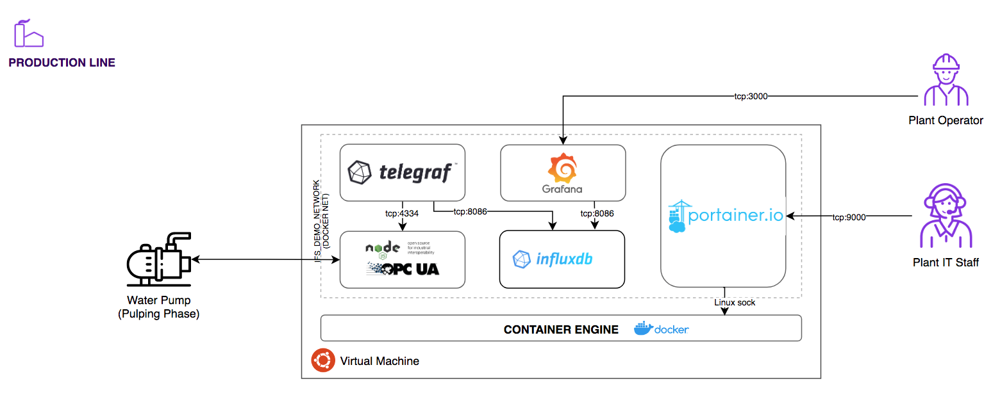
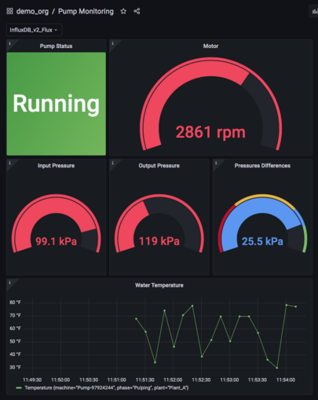

# Modern Historian

## Fully automated provisioning for a modern historian stack

A big part of this setup is about the provisioning of the edge stack with all you need to run a modern historian.

6 Docker containers are used:

- OPC-UA Server
- InfluxDB
- Telegraf
- Grafana
- Portainer
- Traefik

Here is a diagram to show the architecture:

## What you get

Several configurations are applied during the provisioning process in order to automate and simplify the setup. Below is a quick summary of what you get out of the box:

- **OPC-UA Server**:
  - A Pump object added to the OPC-UA server namespace for the scope of the demo scenario. Read more [here](./docs/opc-ua.md) on the setup of the OPC-UA server.
- **InfluxDB v2**:
  - tokens for telegraf and Grafana created
  - bucket created
  - task to calculate prussures differences
- **Telegraf**:
  - configuration to read data from the OPC UA Server
  - configuration to write data into InfluxDB's bucket
- **Grafana**:
  - datasource configuraion
  - demo dashboard
- **Trefik**:
  - Setup Traefik as reverse proxy and load balancer for Portainer and Grafana

InfluxDB2's generated tokens are stored on `output/tokens.txt` file.

Below is a screenshot for the provisioned dashboard:

## Access to the services

In order to get access to the services please, refer to the below table:

| Service     | URL                                     | Username | Password     |
| :---------- | :-------------------------------------- | :------- | :----------- |
| InfluxDB v2 | http://localhost:8086                   | demouser | demopassword |
| Grafana     | https://localhost:6443/grafana          | demouser | demopassword |
| Portainer   | https://localhost:6443/portainer/#!home | admin    |              |
| Traefik     | https://localhost:6443/dashboard/#/     | admin    | demopassword |

To get access to the OPC UA Server, you can use any OPC UA client, e.g. [Prosys](https://downloads.prosysopc.com/opc-ua-client-downloads.php)

As url, use the following `opc.tcp://localhost:4334/UA/DemoOPCUAServer`

**NOTE: In case of cloud deployment, ensure to replace `localhost` with the public IP address of your droplet.**

## Provisioning the demo

The project is available to be provisioned for both Unix-based and Windows users. Follow the relative guides below to get started.

### Linux and OSX users

- [Local provisioning with Vagrant](./docs/provisioning/unix/local_provisioning.md)
- [Cloud provisioning with Terraform](./docs/provisioning/unix/cloud_provisioning.md)

### Windows users

- [Local provisioning with Vagrant](./docs/provisioning/windows/local_provisioning.md)
- [Cloud provisioning with Terraform](./docs/provisioning/windows/cloud_provisioning.md)
