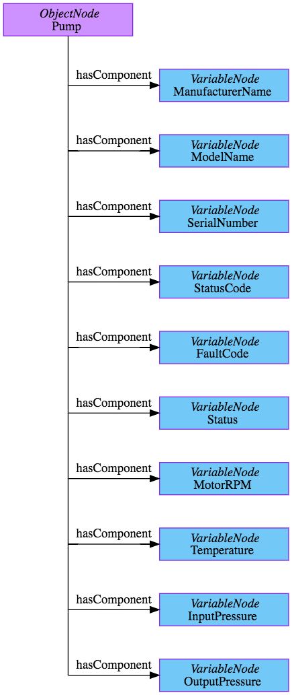

# OPC-UA Server

This setup uses [node-opcua](https://node-opcua.github.io/), an implementation of an OPC UA stack fully written in Typescript for NodeJS.

OPC UA defines 8 Node Class types in the address space Object, Variable, Method, ObjectType, VariableType, ReferenceType, DataType, View.

The server address space is used to customize the objet model that our server will expose to the external world. Server default address space has been extened with some variables we want to expose.

One Objects, a Pump, with relative variables have been added to the server namespace for the scope of the demo scenario.

## Pump Object Information Model

The **Pump** Object has static and dynamic variables used to model our asset, like Manufacturer, Motor RPM etc.
A node of Variable Node class in the OPC UA server is represented in the Data Access COM UA Proxy as an Item.
Below is a mapping table between the pump variables and their NodeIDs

| Variable (BrowserName) | NodeID      |
| ---------------------- | ----------- |
| ManufacturerName       | ns=1;i=1001 |
| ModelName              | ns=1;i=1002 |
| SerialNumber           | ns=1;i=1003 |
| StatusCode             | ns=1;i=1004 |
| FaultCode              | ns=1;i=1005 |
| Status                 | ns=1;i=1006 |
| MotorRPM               | ns=1;i=1007 |
| Temperature            | ns=1;i=1008 |
| InputPressure          | ns=1;i=1009 |
| OutputPressure         | ns=1;i=1010 |

Below, a graphical representation for the pump object:

### Graphviz

The [Graphviz](https://graphviz.org/) source file is available [here](./graphviz/pump_model.dot) too.
