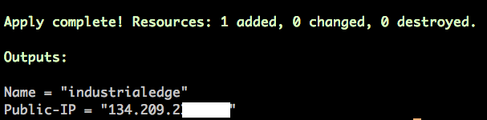
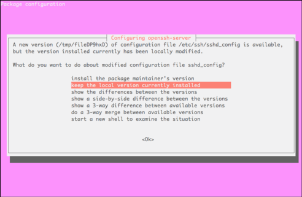

# Cloud Provisioning for Windows

[](https://www.digitalocean.com/?refcode=dc6872965426&utm_campaign=Referral_Invite&utm_medium=Referral_Program&utm_source=badge)

## Prerequisites

To complete the setup, you will need:

- A DigitalOcean account. If you do not have one, [sign up](https://m.do.co/c/dc6872965426) for a new account and get 100$ free credit for 60 days.
- A DigitalOcean Personal Access Token, which you can create via the DigitalOcean control panel. Instructions to do that can be found in this link: [How to Generate a Personal Access Token](https://www.digitalocean.com/community/tutorials/how-to-use-the-digitalocean-api-v2#HowToGenerateaPersonalAccessToken).
- A password-less SSH key added to your DigitalOcean account, which you can do by following [How To Use SSH Keys with DigitalOcean Droplets](https://www.digitalocean.com/community/tutorials/how-to-use-ssh-keys-with-digitalocean-droplets). When you add the key to your account, remember the name you give it, as you’ll need it in this tutorial.

## How-To

### Step 1 - Install the software on you local machine

- **Git**: download Git for Windows from the [project page](https://gitforwindows.org/)
- **Terraform**: download the appropriate package for your OS and architecture from the [official Downloads page](http://www.terraform.io/downloads.html)

### Step 2 - Clone or download the code repository

First thing to be done is to get the source code for this project from GitHub. If you have git installed on your machine, just do a git clone otherwise go the [project page](https://github.com/indaco/modern-historian) and click "Download"

```bash
git clone https://github.com/indaco/modern-historian.git
```

### Step 3 - Update your configs

#### Ansible

- Move into the `ansible/group_vars` folder
- Create a copy for `template_all.yml` file and save it as `all.yml`
- Open and edit the `all.yml` file if you do not want to use the default configurations

#### Terraform

- Move into the `provisioning/unix/cloud/terraform/digitalocean` folder
- Create a copy for `terraform.tfvars.template` file and save it as `terraform.tfvars`
- Open and edit the `terraform.tfvars` file to reflect your settings (DigitalOcean Access Token, Key Fingerprint etc. If you follow the links on the **Prerequisistes** section you will have everything you need, do not worry.)

### Step 4 - Start the VM provisioning

Now it is time to use Terraform.

First you have to initialize terraform. The `terraform init` command is used to initialize a working directory containing Terraform configuration files. This is the first command that should be run after writing a new Terraform configuration or cloning an existing one from version control.

```bash
# You are here: provisioning/unix/cloud/terraform/digitalocean
terraform init
```

You can now proceed:

```bash
# You are here: provisioning/unix/cloud/terraform/digitalocean
terraform plan
terraform apply -auto-approve
```

When the process finish you should see a summary reporting you the name and the public IP for your machine on DigitalOcean.



### Step 5 - Complete the setup

Once the provisioning id finished, login into the machine:

```bash
ssh root@<PUBLIC_IP> -i <PATH_TO_YOUR_SSH_PRIVATE_KEY>
```

Move into the `scripts` folder provisioned during the VM creation phase:

```bash
cd /home/root/scripts
```

Update the system and install the essential packages

```bash
# You are here: /home/root/scripts
bash system-essentials.sh
```

If an upgrade to `openssh-server` exists, the system will ask you how to manage the existing configuration for it



Ensure to preserve the existing one selecting `keep the local version currently installed`

Now it is time to install Ansible

```bash
# You are here: /home/root/scripts
bash ansible-installer.sh
```

### Step 6 - Run the Ansible playbook

Once the Ansible installation finish, run the playbook:

```bash
# /home/vagrant/scripts
bash run-playbook.sh
```

### Step 7 - Do not loose money

Remember that DigitalOcean is a paid service. When yo do not need the environment up and running, destroy it and avoid spending money.

Terraform provide a `destroy` command to do it. The `terraform destroy` command is a convenient way to destroy all remote objects managed by a particular Terraform configuration.

```bash
# You are here: provisioning/unix/cloud/terraform/digitalocean
terraform destroy
```

When you need it again, provisioning it (Refer to **Step 4**).

## Known Issues

### 1. lookup api timeout

It could happen you get errors like the following when you run `terraform apply`:

`Error: Error creating droplet: Post "https://api.digitalocean.com/v2/droplets": dial tcp: lookup api.digitalocean.com on 192.168.1.1:53: read udp 192.168.1.17:58615->192.168.1.1:53: i/o timeout`

Do not worry, just run `terraform apply` again.

### 2. Ansible

If you are encountering any issue when Ansible runs the playbook, just run it again `bash run-playbook.sh`

## Resources

- [Terraform CLI](https://www.terraform.io/docs/cli/commands/)
- [How To Use Terraform with DigitalOcean](https://www.digitalocean.com/community/tutorials/how-to-use-terraform-with-digitalocean)
- [How To Use Ansible with Terraform for Configuration Management](https://www.digitalocean.com/community/tutorials/how-to-use-ansible-with-terraform-for-configuration-management)
